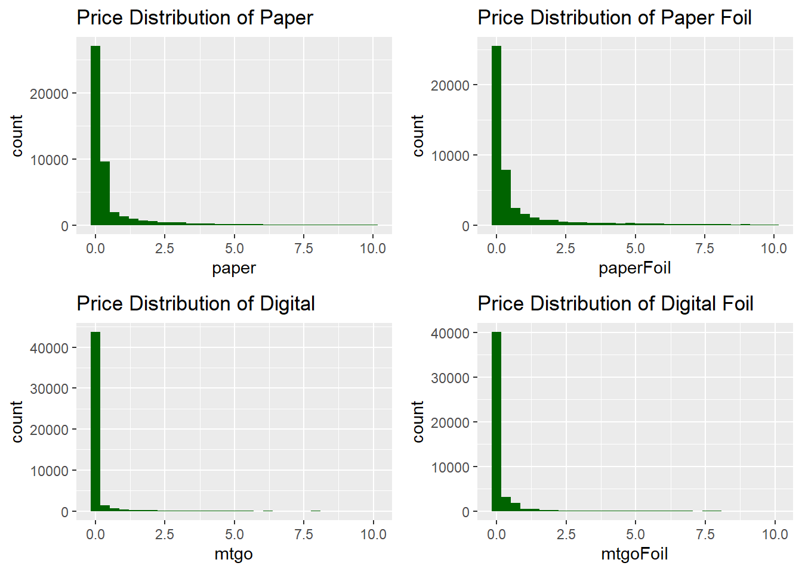
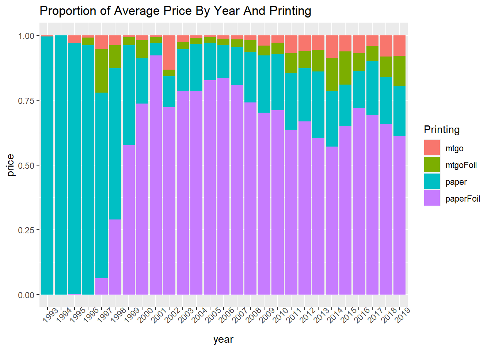

# Descriptive Statistics

## Set-up


## Descriptive Statistics

The following table gives an overview of the numerical variables.  The variable convertedManaCost is an aspect of the card that is used in play. The variable edhrecRank is a numerical score given to the card by the website EDHREC.com which provides card information.  The last four variables (mtgo, mtgoFoil, paper, and paperFoil) indicate different printing of the cards.  Mtgo and mtgoFoil are digital versions of the cards whereas paper and paperFoil are physical. The 'Foil' distinction indicates a shiny quality, either rear or simulated, to the surface of the card. The distribution is heavily skewed with a majority of the cards in the low price range with a few extremely high outliers.  

<table>
 <thead>
  <tr>
   <th style="text-align:left;">   </th>
   <th style="text-align:right;"> convertedManaCost </th>
   <th style="text-align:right;"> edhrecRank </th>
   <th style="text-align:right;"> mtgo </th>
   <th style="text-align:right;"> mtgoFoil </th>
   <th style="text-align:right;"> paper </th>
   <th style="text-align:right;"> paperFoil </th>
  </tr>
 </thead>
<tbody>
  <tr>
   <td style="text-align:left;"> minimum </td>
   <td style="text-align:right;"> 0.000000e+00 </td>
   <td style="text-align:right;"> 1.000 </td>
   <td style="text-align:right;"> 0.0000000 </td>
   <td style="text-align:right;"> 0.0000000 </td>
   <td style="text-align:right;"> 0.000000e+00 </td>
   <td style="text-align:right;"> 0.000000 </td>
  </tr>
  <tr>
   <td style="text-align:left;"> lower-hinge </td>
   <td style="text-align:right;"> 2.000000e+00 </td>
   <td style="text-align:right;"> 2759.000 </td>
   <td style="text-align:right;"> 0.0000000 </td>
   <td style="text-align:right;"> 0.0000000 </td>
   <td style="text-align:right;"> 3.000000e-02 </td>
   <td style="text-align:right;"> 0.000000 </td>
  </tr>
  <tr>
   <td style="text-align:left;"> median </td>
   <td style="text-align:right;"> 3.000000e+00 </td>
   <td style="text-align:right;"> 7445.500 </td>
   <td style="text-align:right;"> 0.0100000 </td>
   <td style="text-align:right;"> 0.0100000 </td>
   <td style="text-align:right;"> 1.400000e-01 </td>
   <td style="text-align:right;"> 0.120000 </td>
  </tr>
  <tr>
   <td style="text-align:left;"> upper-hinge </td>
   <td style="text-align:right;"> 4.000000e+00 </td>
   <td style="text-align:right;"> 13105.000 </td>
   <td style="text-align:right;"> 0.0300000 </td>
   <td style="text-align:right;"> 0.0300000 </td>
   <td style="text-align:right;"> 4.521053e-01 </td>
   <td style="text-align:right;"> 0.900000 </td>
  </tr>
  <tr>
   <td style="text-align:left;"> maximum </td>
   <td style="text-align:right;"> 1.000000e+06 </td>
   <td style="text-align:right;"> 19281.000 </td>
   <td style="text-align:right;"> 345.0200000 </td>
   <td style="text-align:right;"> 100.6400000 </td>
   <td style="text-align:right;"> 1.499900e+04 </td>
   <td style="text-align:right;"> 4159.831579 </td>
  </tr>
  <tr>
   <td style="text-align:left;"> mean </td>
   <td style="text-align:right;"> 4.469705e+01 </td>
   <td style="text-align:right;"> 8113.562 </td>
   <td style="text-align:right;"> 0.2491689 </td>
   <td style="text-align:right;"> 0.3159343 </td>
   <td style="text-align:right;"> 6.993864e+00 </td>
   <td style="text-align:right;"> 3.626086 </td>
  </tr>
  <tr>
   <td style="text-align:left;"> standard deviation </td>
   <td style="text-align:right;"> 6.463173e+03 </td>
   <td style="text-align:right;"> 5822.852 </td>
   <td style="text-align:right;"> 2.5891530 </td>
   <td style="text-align:right;"> 1.8520141 </td>
   <td style="text-align:right;"> 1.297658e+02 </td>
   <td style="text-align:right;"> 27.271963 </td>
  </tr>
</tbody>
</table>

### Distribution of Prices

Each type of card printing follow the same type of right skewed price distribution. The vast majority of the cards are priced in the lower range with some extreme outliers.


```r
p1 <- 
cards[,'paper'] %>% 
  ggplot() + 
  geom_histogram(aes(x=paper, fill=I('darkgreen')),
                 bins = 10) + 
  labs(title = 'Price Distribution of Paper')
p2 <- 
cards[,'paperFoil'] %>% 
  ggplot() + 
  geom_histogram(aes(x=paperFoil, fill=I('darkgreen')),
                 bins = 10) + 
  labs(title = 'Price Distribution of Paper Foil')
p3 <- 
cards[,'mtgo'] %>% 
  ggplot() + 
  geom_histogram(aes(x=mtgo, fill=I('darkgreen')),
                 bins = 10) + 
  labs(title = 'Price Distribution of Digital')
p4 <- 
cards[,'mtgoFoil'] %>% 
  ggplot() + 
  geom_histogram(aes(x=mtgoFoil, fill=I('darkgreen')),
                 bins = 10) + 
  labs(title = 'Price Distribution of Digital Foil')
ggarrange(p1,p2,p3,p4,nrow=2,ncol=2)
```


The following displays the distribution at the lower range of price (<$10). This shows that even at the lower range of prices the distribution is right skewed and centered close to zero.


```r
p1 <- 
cards[,'paper'] %>% 
  filter(paper < 10) %>%
  ggplot() + 
  geom_histogram(aes(x=paper, fill=I('darkgreen')), bins=30) + 
  labs(title = 'Price Distribution of Paper')
p2 <- 
cards[,'paperFoil'] %>% 
  filter(paperFoil < 10) %>%
  ggplot() + 
  geom_histogram(aes(x=paperFoil, fill=I('darkgreen')), bins=30) + 
  labs(title = 'Price Distribution of Paper Foil')
p3 <- 
cards[,'mtgo'] %>% 
  filter(mtgo < 10) %>%
  ggplot() + 
  geom_histogram(aes(x=mtgo, fill=I('darkgreen')), bins=30) + 
  labs(title = 'Price Distribution of Digital')
p4 <- 
cards[,'mtgoFoil'] %>% 
  filter(mtgoFoil < 10) %>%
  ggplot() + 
  geom_histogram(aes(x=mtgoFoil, fill=I('darkgreen')), bins=30) + 
  labs(title = 'Price Distribution of Digital Foil')
ggarrange(p1,p2,p3,p4,nrow=2,ncol=2)
```




### Correlation of Numerical Data

None of the numerical categories show much correlation with the price variables. However, there is some small correlation between the price variables themselves.


```r
cards %>% 
  sample_n(5000) %>%
  select_if(is.numeric) %>%
  chart.Correlation()
```


### Printing type

This is a comparison of card price in one type of printing corresponds to its price in another type of printing.  Often, higher prices in one type of printing correspond to higher prices in another.


```r
q1 <- 
cards[,c("name","paper","paperFoil")]  %>%
  filter(paper > 0 & paperFoil > 0)%>%
  group_by(name) %>%
  ggplot(aes(x = paper, y = paperFoil)) + 
  geom_point() + 
  geom_smooth()
q2 <- 
cards[,c("name","paper","mtgo")] %>%
  filter(paper > 0 & mtgo > 0)%>%
  group_by(name) %>%
  ggplot(aes(x = paper, y = mtgo)) + 
  geom_point() + 
  geom_smooth()
q3 <- 
cards[,c("name","paperFoil","mtgoFoil")] %>%
  filter(paperFoil > 0 & mtgoFoil>0) %>%
  group_by(name) %>%
  ggplot(aes(x = paperFoil, y = mtgoFoil)) + 
  geom_point() + 
  geom_smooth()
q4 <- 
cards[,c("name","mtgo","mtgoFoil")] %>%
  filter(mtgo > 0 & mtgoFoil>0) %>%
  group_by(name) %>%
  ggplot(aes(x = mtgo, y = mtgoFoil)) + 
  geom_point() + 
  geom_smooth()
q5 <- 
cards[,c("name","paper","mtgoFoil")] %>%
  filter(paper > 0 & mtgoFoil>0) %>%
  group_by(name) %>%
  ggplot(aes(x = paper, y = mtgoFoil)) + 
  geom_point() + 
  geom_smooth()
q6 <- 
cards[,c("name","mtgo","paperFoil")] %>%
  filter(mtgo > 0 & paperFoil>0) %>%
  group_by(name) %>%
  ggplot(aes(x = mtgo, y = paperFoil)) + 
  geom_point() + 
  geom_smooth()
ggarrange(q1,q2,q3,q4,q5,q6,ncol=2,nrow=3)
```

```
## `geom_smooth()` using method = 'gam' and formula 'y ~ s(x, bs = "cs")'
## `geom_smooth()` using method = 'gam' and formula 'y ~ s(x, bs = "cs")'
## `geom_smooth()` using method = 'gam' and formula 'y ~ s(x, bs = "cs")'
## `geom_smooth()` using method = 'gam' and formula 'y ~ s(x, bs = "cs")'
## `geom_smooth()` using method = 'gam' and formula 'y ~ s(x, bs = "cs")'
## `geom_smooth()` using method = 'gam' and formula 'y ~ s(x, bs = "cs")'
```


### Frame Version

The frame version variable describes the style of the border around the card and is named by year. The earliest version of the frame is dominated by the 'paper' card type.  The later frame versions show that physical cards fetch higher prices on average with the foil versions fetching the highest price.


```r
# prices by frameVersion (Version of the card frame style.)
cards[,c("frameVersion","mtgo","mtgoFoil","paper","paperFoil")] %>% 
  gather(mtgo,mtgoFoil,paper,paperFoil, 
         key='paperType', 
         value='price',
         na.rm = T) %>% 
  filter(!is.na(frameVersion)) %>%
  group_by(frameVersion,paperType) %>%
  summarise_at('price',mean,rm.na = T) %>%
  ggplot(aes(x = frameVersion, y = price, fill=paperType)) + 
  geom_col(position='dodge') + 
  labs(title='Mean Prices By Frame Version', fill='Printing') + 
  xlab('Frame Version')
```


### Release Date

The cards with the earliest release date fetch the highest prices by far followed by the cards released in 2001. The graph of the proportion of printings shows that foil cards begin to dominate the field around 1999. Interestingly, the 2001 release year had the greatest proportion of foil cards which may factor into the reason why that year had the second highest average price


```r
#mean price by release date and printing type
cards %>% 
  gather(mtgo,mtgoFoil,paper,paperFoil, 
         key='paperType', 
         value='price') %>% 
  group_by(year, paperType) %>%
  summarise_at('price',mean,rm.na=T) %>%
  ggplot(aes(x = year, y = price, fill=paperType)) + 
  geom_col() + theme(axis.text.x = element_text(angle = 45)) +
  labs(title='Mean Price By Year And Printing', fill='Printing')
```


```r
#mean price by release date and printing type excluding the outlier
cards %>% 
  gather(mtgo,mtgoFoil,paper,paperFoil, 
         key='paperType', 
         value='price') %>% 
  group_by(year, paperType) %>%
  filter(year != '1993') %>%
  summarise_at('price',mean,rm.na=T) %>%
  ggplot(aes(x = year, y = price, fill=paperType)) + 
  geom_col() + theme(axis.text.x = element_text(angle = 45)) +
  labs(title='Mean Price By Year (>1993) And Printing', fill='Printing')
```


```r
# proportion of mean price by release date and printing type
cards %>% 
  gather(mtgo,mtgoFoil,paper,paperFoil, 
         key='paperType', 
         value='price') %>% 
  group_by(year, paperType) %>%
  summarise_at('price',mean,rm.na=T) %>%
  ggplot(aes(x = year, y = price, fill=paperType)) + 
  geom_col(position='fill') + theme(axis.text.x = element_text(angle = 45)) +
  labs(title='Proportion of Average Price By Year And Printing', fill='Printing')
```




### Rarity

In the plot of mean price by rarity, the physical cards fetch a higher price than the digital versions. The 'mythic' paper cards with foil fetch the highest price on average followed by the 'rare' paper cards.


```r
# rarity vs price
cards[,c("rarity","mtgo","mtgoFoil","paper","paperFoil")] %>% 
  gather(mtgo,mtgoFoil,paper,paperFoil, 
         key='paperType', 
         value='price',
         na.rm = T) %>%
  group_by(rarity,paperType) %>%
  summarise_at('price',mean,rm.na = T) %>%
  plot_ly(
    x = ~rarity,
    y = ~price,
    color = ~paperType,
    type ='bar',
    mode ='marker'
  ) %>%
  layout(
    title = list(text = 'Mean price by rarity and card type', x=0.02)
  )
```

<!--html_preserve--><div id="htmlwidget-fe802282fdc43b2980c8" style="width:672px;height:480px;" class="plotly html-widget"></div>
<script type="application/json" data-for="htmlwidget-fe802282fdc43b2980c8">{"x":{"visdat":{"451c34d37be8":["function () ","plotlyVisDat"]},"cur_data":"451c34d37be8","attrs":{"451c34d37be8":{"x":{},"y":{},"mode":"marker","color":{},"alpha_stroke":1,"sizes":[10,100],"spans":[1,20],"type":"bar"}},"layout":{"margin":{"b":40,"l":60,"t":25,"r":10},"title":{"text":"Mean price by rarity and card type","x":0.02},"xaxis":{"domain":[0,1],"automargin":true,"title":"rarity","type":"category","categoryorder":"array","categoryarray":["common","mythic","rare","uncommon"]},"yaxis":{"domain":[0,1],"automargin":true,"title":"price"},"hovermode":"closest","showlegend":true},"source":"A","config":{"showSendToCloud":false},"data":[{"x":["common","mythic","rare","uncommon"],"y":[0.0575057284867871,1.7367773284915,0.399403155625285,0.0849635908628451],"mode":"marker","type":"bar","name":"mtgo","marker":{"color":"rgba(102,194,165,1)","line":{"color":"rgba(102,194,165,1)"}},"textfont":{"color":"rgba(102,194,165,1)"},"error_y":{"color":"rgba(102,194,165,1)"},"error_x":{"color":"rgba(102,194,165,1)"},"xaxis":"x","yaxis":"y","frame":null},{"x":["common","mythic","rare","uncommon"],"y":[0.0505371357305026,2.60554269544854,0.464193686878123,0.114960837814128],"mode":"marker","type":"bar","name":"mtgoFoil","marker":{"color":"rgba(252,141,98,1)","line":{"color":"rgba(252,141,98,1)"}},"textfont":{"color":"rgba(252,141,98,1)"},"error_y":{"color":"rgba(252,141,98,1)"},"error_x":{"color":"rgba(252,141,98,1)"},"xaxis":"x","yaxis":"y","frame":null},{"x":["common","mythic","rare","uncommon"],"y":[0.667920691194382,4.1850181969211,19.3777556316666,2.3454026698121],"mode":"marker","type":"bar","name":"paper","marker":{"color":"rgba(141,160,203,1)","line":{"color":"rgba(141,160,203,1)"}},"textfont":{"color":"rgba(141,160,203,1)"},"error_y":{"color":"rgba(141,160,203,1)"},"error_x":{"color":"rgba(141,160,203,1)"},"xaxis":"x","yaxis":"y","frame":null},{"x":["common","mythic","rare","uncommon"],"y":[0.685170300746351,20.3807242689243,6.82029799951703,1.17401042127396],"mode":"marker","type":"bar","name":"paperFoil","marker":{"color":"rgba(231,138,195,1)","line":{"color":"rgba(231,138,195,1)"}},"textfont":{"color":"rgba(231,138,195,1)"},"error_y":{"color":"rgba(231,138,195,1)"},"error_x":{"color":"rgba(231,138,195,1)"},"xaxis":"x","yaxis":"y","frame":null}],"highlight":{"on":"plotly_click","persistent":false,"dynamic":false,"selectize":false,"opacityDim":0.2,"selected":{"opacity":1},"debounce":0},"shinyEvents":["plotly_hover","plotly_click","plotly_selected","plotly_relayout","plotly_brushed","plotly_brushing","plotly_clickannotation","plotly_doubleclick","plotly_deselect","plotly_afterplot","plotly_sunburstclick"],"base_url":"https://plot.ly"},"evals":[],"jsHooks":[]}</script><!--/html_preserve-->

However, the 'rare' physical cards fetched the highest prices overall by far.


```r
# rarity vs price
cards[,c("rarity","mtgo","mtgoFoil","paper","paperFoil")] %>% 
  gather(mtgo,mtgoFoil,paper,paperFoil, 
         key='paperType', 
         value='price',
         na.rm = T) %>%
  group_by(rarity,paperType) %>%
  summarise_at('price',max,rm.na = T) %>%
  plot_ly(
    x = ~rarity,
    y = ~price,
    color = ~paperType,
    type ='bar',
    mode ='marker'
  ) %>%
  layout(
    title = list(text = 'Maximum price by rarity and card type', x=0.02)
  )
```

<!--html_preserve--><div id="htmlwidget-287969d5cca0a82aeea4" style="width:672px;height:480px;" class="plotly html-widget"></div>
<script type="application/json" data-for="htmlwidget-287969d5cca0a82aeea4">{"x":{"visdat":{"451ce3e7976":["function () ","plotlyVisDat"]},"cur_data":"451ce3e7976","attrs":{"451ce3e7976":{"x":{},"y":{},"mode":"marker","color":{},"alpha_stroke":1,"sizes":[10,100],"spans":[1,20],"type":"bar"}},"layout":{"margin":{"b":40,"l":60,"t":25,"r":10},"title":{"text":"Maximum price by rarity and card type","x":0.02},"xaxis":{"domain":[0,1],"automargin":true,"title":"rarity","type":"category","categoryorder":"array","categoryarray":["common","mythic","rare","uncommon"]},"yaxis":{"domain":[0,1],"automargin":true,"title":"price"},"hovermode":"closest","showlegend":true},"source":"A","config":{"showSendToCloud":false},"data":[{"x":["common","mythic","rare","uncommon"],"y":[13.73,87.67,345.02,26.03],"mode":"marker","type":"bar","name":"mtgo","marker":{"color":"rgba(102,194,165,1)","line":{"color":"rgba(102,194,165,1)"}},"textfont":{"color":"rgba(102,194,165,1)"},"error_y":{"color":"rgba(102,194,165,1)"},"error_x":{"color":"rgba(102,194,165,1)"},"xaxis":"x","yaxis":"y","frame":null},{"x":["common","mythic","rare","uncommon"],"y":[20.94,100.64,57.17,46.34],"mode":"marker","type":"bar","name":"mtgoFoil","marker":{"color":"rgba(252,141,98,1)","line":{"color":"rgba(252,141,98,1)"}},"textfont":{"color":"rgba(252,141,98,1)"},"error_y":{"color":"rgba(252,141,98,1)"},"error_x":{"color":"rgba(252,141,98,1)"},"xaxis":"x","yaxis":"y","frame":null},{"x":["common","mythic","rare","uncommon"],"y":[350,212.31,14999,1399.99],"mode":"marker","type":"bar","name":"paper","marker":{"color":"rgba(141,160,203,1)","line":{"color":"rgba(141,160,203,1)"}},"textfont":{"color":"rgba(141,160,203,1)"},"error_y":{"color":"rgba(141,160,203,1)"},"error_x":{"color":"rgba(141,160,203,1)"},"xaxis":"x","yaxis":"y","frame":null},{"x":["common","mythic","rare","uncommon"],"y":[334.99,599.39,4159.83157894737,207.058421052632],"mode":"marker","type":"bar","name":"paperFoil","marker":{"color":"rgba(231,138,195,1)","line":{"color":"rgba(231,138,195,1)"}},"textfont":{"color":"rgba(231,138,195,1)"},"error_y":{"color":"rgba(231,138,195,1)"},"error_x":{"color":"rgba(231,138,195,1)"},"xaxis":"x","yaxis":"y","frame":null}],"highlight":{"on":"plotly_click","persistent":false,"dynamic":false,"selectize":false,"opacityDim":0.2,"selected":{"opacity":1},"debounce":0},"shinyEvents":["plotly_hover","plotly_click","plotly_selected","plotly_relayout","plotly_brushed","plotly_brushing","plotly_clickannotation","plotly_doubleclick","plotly_deselect","plotly_afterplot","plotly_sunburstclick"],"base_url":"https://plot.ly"},"evals":[],"jsHooks":[]}</script><!--/html_preserve-->
